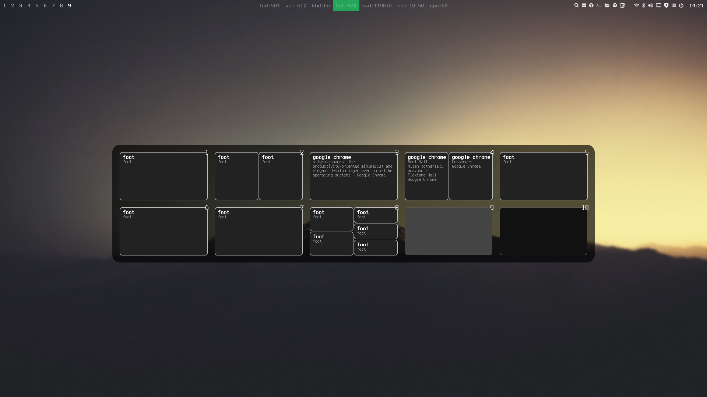
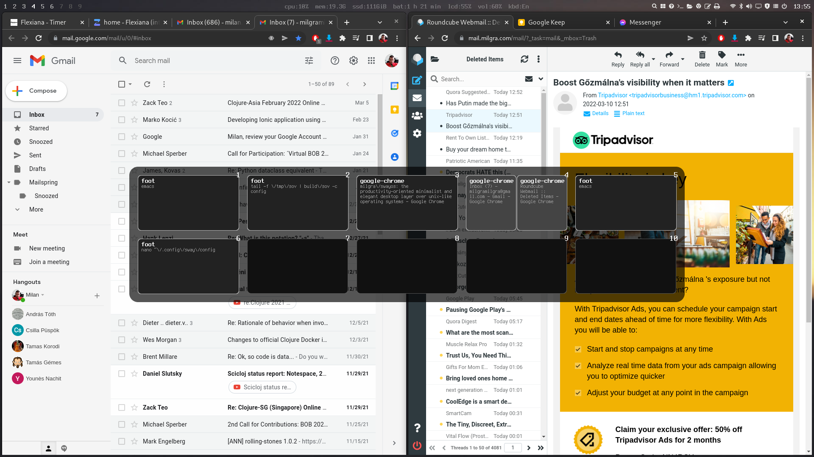

add network
add to sudoer

autostart install
press enter to restart machine
swayos script install git only, checkout repo, use package lists
create patreon packages
splash screen replace
better locale setup
wayland
proper screen sharing with chrome
help to background

issues :
Discussion : github.com/swayos/disc


Problem with install?

CTRL+Z before restart
check swayos_install_log and stderr and stdout


How does the installer works?

the installer script for pre-installed systems

the installer iso

# SwayOS

SwayOS is a productivity-oriented minimalist and super elegant desktop layer over unix-like operating systems that also can be installed as a standalone OS.

**Donations**  
paypal : [https://paypal.me/milgra](https://paypal.me/milgra) / patreon : [https://www.patreon.com/milgra](https://www.patreon.com/milgra) / bitcoin : 37cSZoyQckihNvy939AgwBNCiutUVN82du  




## How does it help productivity?


The more time you can spend working on your task the more productivity you can achieve. The more time you have to spend using the OS, dealing with windows, looking for things, clicking in submenus the less productivity you can achieve.

SwayOS shows all necessary information at a glance : if you keep WIN + numbers pushed, you see all workspaces, all windows in the workspaces, all commands in the terminals, page titles in the browser, you see your computers hardware status in the center of the status bar and you can also reach all hardware settings with one click and all regularly used softwares with one click. It's just unbelievable! :)

SwayOS is workspace oriented. Before opening an application you have to select a workspace where you want to open it. You can move the application to an other workspace any time if it fits your workflow better. It's like a multi-monitor setup but with one monitor!

SwayOS handles window placement automatically, windows always take the maximum space available, they don't even have title bars, close, maximize buttons. You can close and resize them with key combinations.

For example if you want to open three terminal windows in workspace three, you switch to workspace three by pressing WIN + 3 and press WIN + ENTER three times ( that is the shortcut for the terminal ) or press the terminal icon three times ( in the status bar ) or press WIN + SPACE and select the terminal you want to start, three times.
If you want to close one terminal you move your mouse over it and press WIN + SHIFT + Q.
If you want to move one terminal window to workspace four you move your mouse over it and press WIN + SHIFT + 4.
These are all the shortcuts you have to know.

So to recap the shortucts :

**WIN + numbers** : switch to workspace with given number / open overview ( long press )  
**WIN + SPACE** : open application launcher  
**WIN + SHIFT + Q** : close focused window  
**WIN + SHIFT + numbers** : move focused window to workspace with given number  

SwayOS tries to be a distraction free OS. So there is no notification system installed by default altough you can install one any time, you also have to manage software updates manually by opening the app store and check for available updates.

## Additional shortcuts that make work easier

**WIN + arrows** : set focus to neighbouring windows  
**WIN + R** : resize mode, if there are more windows in a workspace you can press WIN + R, resize window with arrows, then press ESC  
**WIN + ENTER** : open a terminal  
**WIN + SHIFT + ENTER** : open browser  
**ALT + SPACE** : switch keyboard layout if there are more  
**WIN + PrtScr** : take screenshot  
**WIN + SHIFT + SPACE** : toggle/untoggle floating over a window

## Installation ##

**For beginners/Speed install**

Download the latest installer ISO from [releases](https://github.com/swayos/swayos.github.io/releases), burn it to a pendrive/etc and start your machine up with it. Installer will start automagically.

Note : it is a minimal-configuration installer, there are no partitioning options, it will use the full hard drive for installation.

**For more install options**

Download the latest [Arch Linux installer ISO](https://archlinux.org/download/). After startup, type "archinstall" that guides you through the install process. After finish, log in with your user and install SwayOS with
```
curl -O https://swayos.github.io/swayos
sh swayos
```

**For superhackers/For other OSes/distributions**

Install all packages present in "packages" file. Package names on your OS/Distribution may differ. Then copy everything under "home" to your home folder. Start services if needed. ( iwd, cups, etc )

## UI Structure of SwayOS

SwayOS's UI has two parts : the status bar ( on top by default ) and the desktop under the status bar.  
The status bar has the following sections from left to right : workspace numbers block ( indicators ) , hardware status block ( in the center by default ), quick launch icons block, hardware settings icon block and clock/calendar on the right.

**Icons from right to left :**

 shutdown  
 activity monitor  
 app store/software updates  
 multi-display setup  
 volume control  
 bluetooth control  
 wifi setup  

 printer setup  
 libreoffice  
 google chrome  
 file manager  
 terminal  
 application launcher  

## Components and how to configure them

- **sway wm** : Sway Window Manager, config file is /home/youruser/.config/sway/config , learn more about it's configuration [here](https://github.com/swaywm/sway/wiki)
- **waybar** : Status Bar Manager, config file is  /home/youruser/.config/waybar/config , learn more about it's config [here](https://github.com/Alexays/Waybar/wiki)
- **wofi** : Application launcher, config file is /home/youruser/.config/wofi/config, visible when pressing WIN + SPACE
- **wob** : Volume/Brightness overlay bar, visible when you change volumes with the dedicated keys on your laptop, configurable in sway config
- **sway-overview** : Workspace overview window, visible when you press the WIN + numbers for a longer period, config file is /home/youruser/.config/sway-overview/config
- **swaylock** : Screen locker, locks automatically or lock manually from the shutdown menu
- **swayidle** : Idle time handler, locks screen automatically after 10 minuter
- **grim** : Screen capture utility, activated with WIN + PRTSCR
- **slurp** : Screen region capture utility, activated with WIN + SHIFT + PRTSCR
- **iwgtk** : wifi selector app
- **blueman** : bluetooth selector app
- **brightnessctl** : lcd brightness control
- **feh** : image viewer, opened when you double click on an image in file manager
- **terminus-font** : default font for desktop and terminal
- **ubuntu-font** : default font for applications
- **pipewire** : audio/video server, needed for chrome desktop sharing and faster bluetooth audio
- **pamac-manager** : app store/system updater
- **pavucontrol** : volume control ui
- **polkit-gnome** : GUI Authentication agent
- **wdisplays** : display manager
- **wlogout** : logout manager
- **zsh** : shell
- **gnome-system-monitor** : activity/process monitor ui
- **qt5-style-plugings** : to make qt apps look like gtk2 apps
- **system-config-printer** : printer manager

## Default applications

- **foot** : super fast terminal, config file is /home/youruser/.config/foot/config
- **nautilus** : file manager
- **google chrome** : browser
- **LibreOffice** : document and spreadsheet editor

## How to add new icons/applications to the quick launch menu?

Edit waybar config at /home/youruser/.config/waybar/config , add new custom blocks for your desired applications, get symbols from (fontawesome)[https://fontawesome.com/search?s=solid%2Cbrands].

## How to mount external usb devices?

Just click on the file manager icon in the status bar, it will auto-mount connected usb drives.

## How to add multiple keyboard input sources?

Edit sway config, add

```
input "1165:49408:ITE_Tech._Inc._ITE_Device(8910)_Keyboard" {
    ...
    xkb_layout "us,hu"
    xkb_options "grp:alt_space_toggle"
    ...
}
```

## Setting default terminal and browser

Edit sway confing at /home/youruser/.config/sway/conifg, modify $terminal and $browser constant values

## To be done :

- visual input source selector
- visual display brightness slider
- better looking bluetooth/wifi ui, maybe connmangtk?
- replace Nautilus with Zen Files when it is mature enough or add as an alternative
- unified wifi/bluetooth/shutdown UI popup like in MacOS/Gnome?

## Why google chrome instead of chromium?

SwayOS's intention is to create a user-friendly tiling window manager experience for less experienced users/switchers, and for that Libreoffice and Google sync enabled chrome is mandatory. Spotify and netflix are also a reason.

## How to change display brightness

- brightness keys
- move mouse over lcd pecentage in status bar and scroll

## What applications do yoy propose for multimedia work?

- shotcut
- gimp
- steam

## Don't forget to check for updates regularly!

## How to make a specific program open in a floating window always?

Enable the program to be a floating in sway config.

## Where can I see all my installed applciations?

Launch app store, under Installed you see all programs your system have and among them there are your desktop apps.

## Hardinfo starts from the hardware icons in the status bar but won't start from terminal, why?

You have to tell it to use X11 mode with 'GDK_BACKEND=x11 hardinfo'

cups, wdisplays, qt gtk2

## TODO ##

setups all keyboards and touchpads with defaults in sway config

## Recommended programs installable from app store ##

hardinfo for hardware information
tlp for energy saving features
gimp for image processing
shotcut for video editing
nvidia for nvidia/nvidia-intel hybrid gpus
ati for ati/ati-intel hybrud gpus
noisetorch for noise cancellation during meetings
qemu and virt-manager for virtualization

Photoshop -> GIMP
Illustrator -> Inkscape
After Effects -> Natron
Premiere Pro - Davinci Resolve
Adobe XD -> Figma
Cinema 4D/3DS Max -> Blender

# Chrome says its out of date #

Open a terminal, type yay -S google-chrome