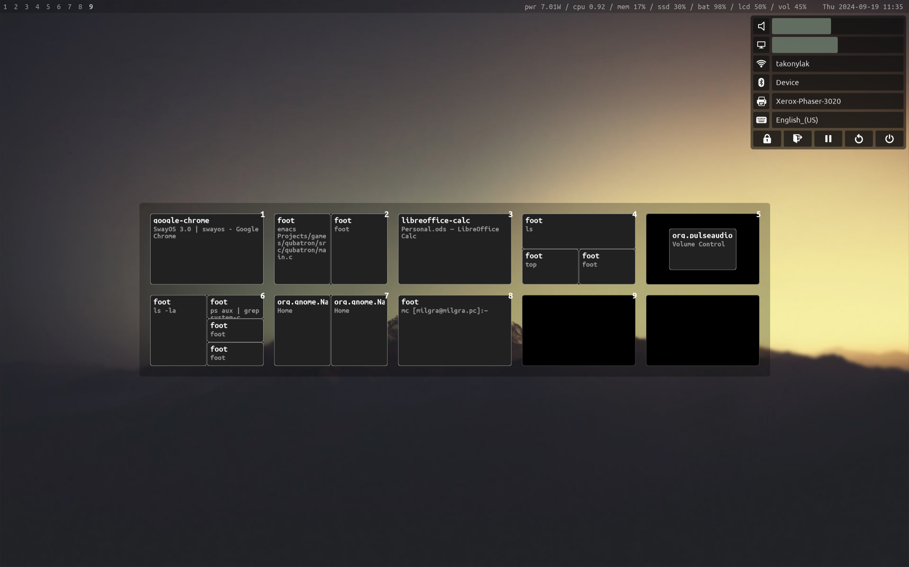

# SwayOS

SwayOS is a productivity-oriented minimalist and super elegant desktop layer for unix-like operating systems. It is suitable for office, internet, system administration and programming work out of the box. It contains four special apps created exclusively for SwayOS : MultiMedia File Manager, Visual Music Player, Sway Overview and Wayland Control Panel.



[](pics/swayos-apps.png)
[](pics/swayos.png)
[](pics/swayos-busy.png)
[](pics/swayos-help.jpg)

**Donations**  
paypal : [https://paypal.me/milgra](https://paypal.me/milgra)  
patreon : [https://www.patreon.com/milgra](https://www.patreon.com/milgra)  
bitcoin : 37cSZoyQckihNvy939AgwBNCiutUVN82du      
**Discussions/Issues/Feature requests**  
[https://github.com/swayos/swayos.github.io/discussions](https://github.com/swayos/swayos.github.io/discussions)  
**Source**  
[https://github.com/swayos/swayos.github.io](https://github.com/swayos/swayos.github.io)

## How does it help productivity?

The more time you can spend working on your task the more productivity you can achieve. The more time you have to spend using the OS, dealing with windows, looking for things, clicking in submenus the less productivity you can achieve.

SwayOS shows all necessary information at a glance : if you keep WIN + numbers pushed, you see all workspaces, all windows in the workspaces, all commands in the terminals, page titles in the browser, you see your computers hardware status in the center of the status bar and you can also reach all hardware settings with one click and all regularly used softwares with one click. It's just unbelievable! :)

SwayOS is workspace oriented. Before opening an application you have to select a workspace where you want to open it. You can move the application to an other workspace any time if it fits your workflow better. It's like a multi-monitor setup but with one monitor!

SwayOS handles window placement automatically, windows always take the maximum space available, they don't even have title bars, close, maximize buttons. You can close and resize them with key combinations.

For example if you want to open three terminal windows in workspace three, you switch to workspace three by pressing WIN + 3 and press WIN + ENTER three times ( that is the shortcut for the terminal ) or press the terminal icon three times ( in the status bar ) or press WIN + SPACE and select the terminal you want to start, three times.
If you want to close one terminal you move your mouse over it and press WIN + SHIFT + Q.
If you want to move one terminal window to workspace four you move your mouse over it and press WIN + SHIFT + 4.
These are all the shortcuts you have to know.

SwayOS tries to be a distraction free OS. So there is no notification system installed by default altough you can install one any time, you also have to manage software updates manually by opening the app store and check for available updates.

## Shortcuts ##

**WIN + numbers** : switch to workspace / open overview ( long press )  
**WIN + SPACE** : open application launcher  
**WIN + SHIFT + Q** : close focused window  
**WIN + SHIFT + numbers** : move focused window to workspace with given number  

## Additional shortcuts that make work easier

**WIN + arrows** : set focus to neighbouring windows  
**WIN + SHIFT + arrows** : move window to a new position inside the workspace  
**WIN + R** : resize mode, if there are more windows in a workspace you can press WIN + R, resize window with arrows, then press ESC  
**WIN + ENTER** : open a terminal  
**WIN + SHIFT + ENTER** : open browser  
**ALT + SPACE** : switch keyboard layout if there are more  
**WIN + PrtScr** : take screenshot  
**WIN + SHIFT + SPACE** : toggle/untoggle floating over a window

## Description ##
SwayOS is a productivity-oriented, resource efficient and elegant desktop layer for unix-like operating systems. It uses a tiling window manager so you don't have to deal with minimizing/maximizing/moving windows any more. Windows are placed automatically and always open. To avoid crowdedness you place your windows onto workspaces. Workspace numbers are in the top left corner. You select workspaces by pressing WIN + numbers. WIN + 1 selects the first workspace, WIN + 0 the 10th workspace, WIN + SHIFT + 1 selected the 11th workspace. You can also select a workspace by clicking on its number. Close applications with WIN + SHIFT + W. To open an application press WIN + SPACE to open the launcher. Type the program name you want to launch and press enter. An alternative way to open an application is to press it's icon in the top right corner.
The magnifier glass icon opens the launcher you opened before with WIN + SPACE. Press ESC to close it.
The prompt icon opens the terminal. Another way to open the terminal is to press WIN + ENTER.
The folder icon opens the file manager.
The chrome icon opens google chrome. Another way to open google chrome is to press WIN + SHIFT + ENTER.
The page icon opens LibreOffice.
The media file icon open MultiMedia File Manager.
The music icon opens Visual Music Player.
The printer icon opens the printer settings.
The shield icon opens the app store/software updates.
The workspaces icon opens the workspace overview. Another way to open it is to long press workspace selector buttons, for example WIN + 1
The settings icon opens the system settings menu where you can set volume, display brightness, open audio settings, open display settings, select wifi channel, select bluetooth device and you can exit you session in different ways.
If you have a lot of workspaces open with a lot of windows, use the workspace overview app, by long pressing WIN + workspace numbers or the workspace overview icon in the status bar.
System information is always visible in the center of the status bar, from left to right : the cpu usage, available memory, available free space, battery percentage, display brightness, volume. You can adjust brightness and volume by just scrolling over their icon, it's a nice shortcut if you don't want to open up the system menu.
You can install SwayOS on any kind of unix-like OS. The installer image downloadable from swayos.github.io is arch linux based, for further help, documentation and troubleshooting please use arch linux site/forums.

## Installation ##

SwayOS install scripts are available for Void Linux, Arch Linux, Debian ( >=12 ) and FreeBSD.
Start with a clean minimal install of any of these systems, with network connection. Then

```
curl -O https://swayos.github.io/setup
bash setup

or

wget -O https://swayos.github.io/setup
bash setup

or install wget or curl if none of the above works
```

I recommend Void Linux because it's minimalism, speed and elegance fits the philosophy of SwayOS.

**Optional Post-installation todos**

- set font sizes according to your display size and resolution in foot and sway and waybar config files
- setup pipewire support in chrome, go to url chrome://flags/#enable-webrtc-pipewire-capturer
- set google chrome's appereance to GTK+ so it will use the dark theme
- set locale to your language ( will be added to installer later )
- set your keyboard language in sway config ( will be added to installer later )
- remove export WLR_NO_HARDWARE_CURSORS=1 from .zshrc ( will be added to installer later )
- remove swayos_setup_* log files from your home directory
- don't forget to check for updates regularly!
- to open root GTK apps from wayland use sudo -EH appname
- on void linux install vaapi drivers for you gpu ( intel-video-accel, mesa-intel-dri ) for video acceleration

## UI Structure of SwayOS

SwayOS's UI has two parts : the status bar ( on top by default ) and the window area under the status bar.
The status bar has the following sections from left to right : workspace numbers block ( indicators ) , hardware status block ( in the center by default ), quick launch icons block, hardware settings icon block and clock/calendar on the right.

**Icons from right to left :**

 system menu ( volume, brightness, audio settings, display settings, wifi, bluetooth, session handling )
 workspaces overview
 app store/software updates  
 bluetooth control  
 wifi setup  

 printer setup
 visual music player
 multimedia file manager/viewer
 libreoffice  
 google chrome  
 file manager  
 terminal  
 application launcher

## Usage of SwayOS ##

By default you have these applications :

- Google Chrome for internet
- LibreOffice for office work
- Nautilus as file manager
- Foot for terminal
- Visual Music Player for offline music
- MultiMedia File Manager for media/document viewing and managing

You open apps by pressing WIN key + SPACE or by clicking on the quick launch icons.
If you need anything else open the app store by clicking on the shield icon on the right side of the status bar, search for it and click on the green download button.

Recommended multimedia applications :

Photopea for Photoshop replacement ( www.photopea.com )
Inkscape for vector graphics ( Illustrator replacement )  
Natron for video post processing ( After Effects replacement )  
Davinci Resolve for video editing ( Premiere Pro replacement )  
Shotcut for simpler video editing  
Blender for 3D modelling and rendering ( 3DSMax/Cinema 4D replacement )  
Steam for gaming. Enable proton in its settings and you can play 95% of all windows games  

Recommended system tools :

tlp for energy saving features  
nvidia for nvidia/nvidia-intel hybrid gpus  
ati for ati/ati-intel hybrud gpus  
noisetorch for noise cancellation during meetings  
qemu and virt-manager for virtualization  
swaync for notification center  

You should create a Documents and a Downloads folder under your home directory and save work and downloaded files there.
The file manager opens in floating mode so you can drag and drop files on your applications if needed if you open the file managaer in the same workspace.

If you don't have multimedia keys the you can change volume and display brightness by going over the lcd and vol entries in the center of the status bar and do a scroll over them.

## Components and how to configure them

- **sway wm** : Sway Window Manager, config file is /home/youruser/.config/sway/config , learn more about it's configuration [here](https://github.com/swaywm/sway/wiki)
- **waybar** : Status Bar Manager, config file is  /home/youruser/.config/waybar/config , learn more about it's config [here](https://github.com/Alexays/Waybar/wiki)
- **wofi** : Application launcher, config file is /home/youruser/.config/wofi/config, visible when pressing WIN + SPACE
- **wob** : Volume/Brightness overlay bar, visible when you change volumes with the dedicated keys on your laptop, configurable in sway config
- **sov** : Workspaces overview layer, visible when you press the WIN + numbers for a longer period or the workspaces icon in the status bar, config file is /home/youruser/.config/sway-overview/config
- **wcp** : Wayland Control Panel, visible when you press WIN + p or the settings icon in the status bar next to the clock, configurable in sway config
- **swaylock** : Screen locker, locks automatically or lock manually from the shutdown menu, set up in sway wm's config
- **swayidle** : Idle time handler, locks screen automatically after 10 minuter, set up in sway wm's config
- **grim** : Screen capture utility, activated with WIN + PRTSCR, set up ins sway wm's config
- **slurp** : Screen region capture utility, activated with WIN + SHIFT + PRTSCR, set up ins sway wm's config
- **iwgtk** : wifi selector app, no config file
- **blueman** : bluetooth selector app, no config file
- **brightnessctl** : lcd brightness control, set up ins sway wm's config
- **terminus-font** : default font for desktop and terminal
- **ubuntu-font** : default font for applications
- **pipewire** : audio/video server, needed for chrome desktop sharing and faster bluetooth audio
- **pamac-manager** : app store/system updater
- **pavucontrol** : volume control ui
- **polkit-gnome** : GUI Authentication agent
- **wdisplays** : display manager
- **wlogout** : logout manager
- **zsh** : shell
- **gnome-system-monitor** : activity/process monitor ui
- **qt5-style-plugings** : to make qt apps look like gtk2 apps
- **system-config-printer** : printer manager
- **visual music player** : offline music/video player, parses files under ~/Music
- **multimedia file manager** : media/document file viewer/player/manager

## Frequently Asked Questions

- **How to change display brightness**  
with brightness keys  
by moving mouse over lcd pecentage in status bar and scroll

- **How to change volume**  
with volume keys  
by moving mouse over volume percentage in status bar and scroll  
by clicking on the audio icon in the status bar  

- **How to mount external usb devices?**  
Just click on the file manager icon in the status bar, it will auto-mount connected usb drives.

- **How to add new icons/applications to the quick launch menu?**  
Edit waybar config at /home/youruser/.config/waybar/config , add new custom blocks for your desired applications, get symbols from (fontawesome)[https://fontawesome.com/search?s=solid%2Cbrands].

- **How to add multiple keyboard input sources?**  
Edit sway config, add

```
input " your wanted device id " {
    ...
    xkb_layout "us,hu"
    xkb_options "grp:alt_space_toggle"
    ...
}
```

- **Why google chrome instead of chromium?**  
SwayOS's intention is to create a user-friendly tiling window manager experience for less experienced users/switchers, and for that Libreoffice and Google sync enabled chrome is mandatory, spotify and netflix are also a reason.

- **Where can I see all my installed applciations?**  
Launch app store, under Installed you see all programs your system have and among them there are your desktop apps.

- **How to make a specific program open in a floating window always?**  
Enable the program to be a floating in sway config.

- **Chrome says its out of date**  
Open the app store, open preferences, go to third-party, Enable AUR support and enable check for updates

## How it works ##

SwayOS is based on Sway Window Manager, which is a window manager and compositor in one, it gives pixel buffers to programs where they can draw their content and the it flattens these buffers onto the screen. It is a standalone program that can be started manually or automatically.

In SwayOS if you log in the default console ( tty0 or ttyv0 ) then it starts up automatically. If you check the contents of your .zshrc ( ~/.zshrc ) you will see "exec sway" in the end.
It needs an environment variable called XDG_RUNTIME_DIR to be set. This points to the folder where sway and other programs put their temporary files during the session. On systemd systems it is usually /run/user/$UID, in SwayOS it's ~/.config/xdg. It is also set in .zshrc before executing sway.

## TODO ##

update.sh that re-compiles 3rd party stuff